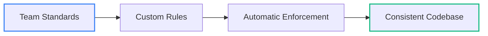

カスタムルールにより、Greptile は組織特有のベストプラクティスをすべてのプルリクエストにわたって適用し、チームで定めた標準への一貫性と遵守を確保します。

## 組織標準の徹底

カスタムルールにより、チームのベストプラクティスをすべてのコードレビューで一貫して適用し、人間のレビュアーでは見落としがちな逸脱も検知できます。

## 一般的なカスタムルールの例

<AccordionGroup>
<Accordion title="Architecture & Design Patterns">
- コントローラーはデータベースモデルを直接インポートせず、サービス経由で扱うこと
- ドメインロジックは外部フレームワークやライブラリに依存しないこと
- すべてのデータベースアクセスにリポジトリパターンを用いること
- すべての API エンドポイントは RESTful な命名規則に従うこと
- GraphQL リゾルバーはビジネスロジックをサービスクラスに委譲すること
- すべての API エンドポイントでエラーレスポンス形式を統一すること
- React コンポーネントは props に TypeScript のインターフェースを使用すること
- Vue コンポーネントは Options API ではなく Composition API を使用すること
- Angular コンポーネントはクリーンアップのために OnDestroy を実装すること
</Accordion>

<Accordion title="Security & Compliance">
- すべてのユーザー入力は処理前に検証すること
- SQL クエリはインジェクション防止のためパラメータ化クエリを使用すること
- ファイルアップロードはコンテンツタイプとサイズの検証を行うこと
- 保護された API ルートには認証ミドルウェアを含めること
- 管理機能にはロールベースのアクセス制御チェックを行うこと
- セッショントークンには有効期限を設定すること
- 個人データへのアクセスは監査目的でログに記録すること
- 機微情報は保存時に暗号化すること
- ソースコードにハードコードされたシークレットや API キーを含めないこと
</Accordion>

<Accordion title="Code Quality & Performance">
- 非同期関数には try-catch ブロックによる適切なエラーハンドリングを含めること
- データベース接続は使用後に適切にクローズすること
- すべての API リクエストはトレース用にリクエスト ID とともにログに記録すること
- 公開メソッドには対応するユニットテストを用意すること
- 関数の複雑度には上限を設けること
- ネストしたコールバックは避け、代わりに async/await を使用すること
- メモリ集約的な処理にはクリーンアップを含めること
- 頻繁にアクセスされるデータは適切にキャッシュすること
</Accordion>

<Accordion title="JavaScript/TypeScript Best Practices">
- 変数宣言には var ではなく const/let を使用すること
- 可読性のため Promise チェーンより async/await を優先すること
- 緩やかな等価（==）ではなく厳密等価（===）を使用すること
- すべての関数に戻り値の型を定義すること
- 意味のある変数名と関数名を使用すること
- any 型は避け、具体的な型を使用すること
- Promise の拒否は明示的に処理すること
</Accordion>

<Accordion title="Python Best Practices">
- 命名規則は PEP 8 のスタイルガイドに従うこと
- 適切な場合はループの代わりにリスト内包表記を使用すること
- すべての関数パラメータと戻り値に型ヒントを付与すること
- リソース管理にはコンテキストマネージャーを使用すること
- 文字列連結より f-strings を優先すること
- 例外は特定の例外型で処理すること
- 単純なデータコンテナには dataclasses を使用すること
</Accordion>

<Accordion title="Go Best Practices">
- 慣用的な Go のパターンと規約に従うこと
- エラーは明示的に処理し、無視しないこと
- 意味のある変数名を使用し、1 文字の変数は避けること
- 抽象化にはインターフェースを使用すること
- 埋め込みよりコンポジションを優先すること
- キャンセルやタイムアウトには context を使用すること
- struct のフィールドは明示的に初期化すること
</Accordion>

<Accordion title="Java Best Practices">
- オプションの値には null を返す代わりに Optional を使用すること
- コード再利用には継承よりコンポジションを優先すること
- try-with-resources でリソースを適切にクローズすること
- ループ内の文字列連結には StringBuilder を使用すること
- フィールドは private にし、ゲッター／セッターを使用すること
- 変更不可の変数には final キーワードを使用すること
- チェック例外は適切に処理すること
</Accordion>
</AccordionGroup>
