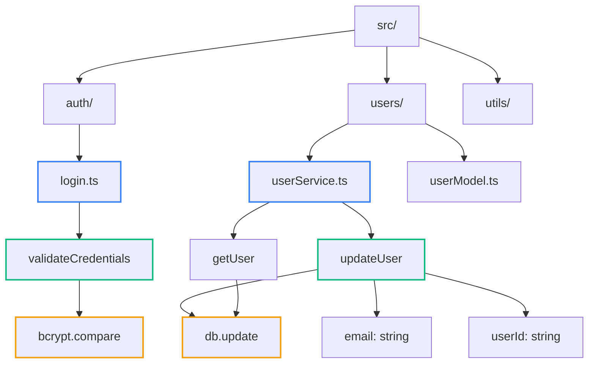
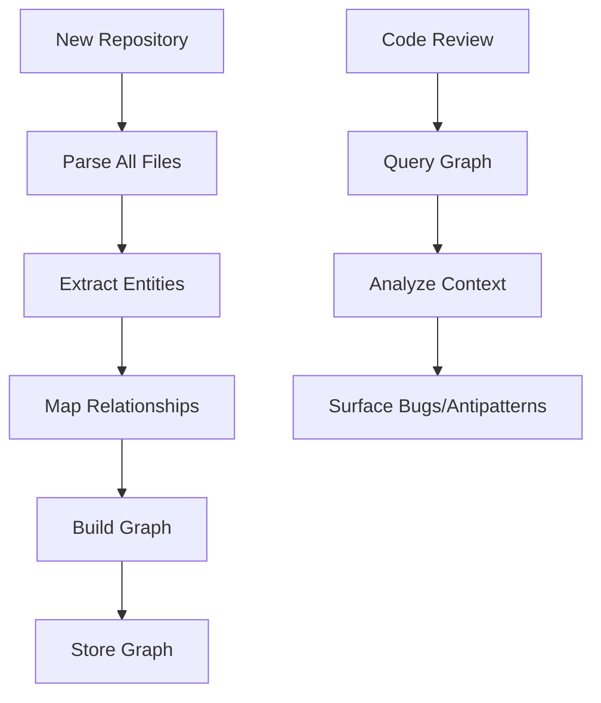
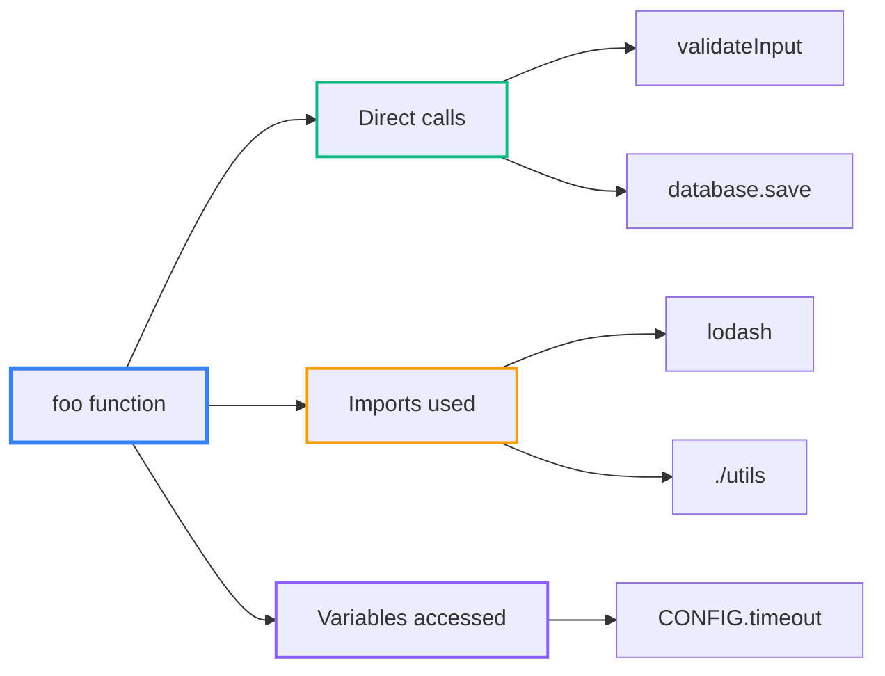

Greptile は、コード変更がシステムの他の部分に与える影響を把握するために、コードベース全体の完全なグラフを構築し、従来のツールでは見逃されがちな問題を検出できるコンテキスト認識のコードレビューを可能にします。

## コードベースのコンテキストが重要な理由

多くのコードレビューツールはファイルを単体で分析するため、重要な関連性を見落としがちです:

**コンテキストなし:**
```typescript
// この関数だけをレビュー
function updateUserEmail(userId: string, email: string) {
  return db.users.update(userId, { email });
}
// ❌ 見落とし: バリデーションのパターン、エラーハンドリング、関連関数
```

**コンテキストあり:**
```typescript
// Greptile は全体像を把握する
function updateUserEmail(userId: string, email: string) {
  return db.users.update(userId, { email });
  // ✅ 指摘: 他の update 関数では入力を検証している
  // ✅ 指摘: 類似の関数ではエラーを適切に処理している
  // ✅ 指摘: メール更新は別の箇所で通知を発火させる
}
```

## コードベースのインデックス作成

サインアップすると、Greptile はリポジトリ内のあらゆるコード要素を含む完全なグラフを構築します：



**凡例：** 🔵 ファイル • 🟢 関数 • 🟡 外部呼び出し／変数

### インデックス作成プロセス

<Steps>
<Step title="Repository Scanning">
すべてのファイルを解析して、ディレクトリ、ファイル、関数、クラス、変数を抽出します
</Step>

<Step title="Relationship Mapping">
関数呼び出し、インポート、依存関係、変数の使用など、すべての要素を関連付けます
</Step>

<Step title="Graph Storage">
コードレビュー時の即時クエリのために、完全なグラフを保存します
</Step>
</Steps>



## Greptile は関数をどのように解析するか

変更された関数 `foo(x)` をレビューする際、Greptile はグラフにクエリして次を把握します：

### 1. 関数の依存関係



### 2. 関数の使用箇所

```typescript
// Greptile は foo() の呼び出し箇所をすべて見つけます
function foo(x: string) {
  return processData(x);
}

// 発見された使用箇所:
// ✅ components/UserForm.tsx:45  
// ✅ services/DataService.ts:12
// ✅ tests/integration.test.ts:78
// → 影響分析: 変更は 3 ファイルに影響
```

### 3. パターンの整合性

```typescript
// この SQL 関数をレビューする場合:
function getUserById(id: string) {
  return db.query('SELECT * FROM users WHERE id = $1', [id]);
}

// Greptile は他の SQL 関数もチェックします:
// ✅ getUserByEmail() - パラメータ化クエリを使用 ✓
// ❌ getOrderById() - 文字列連結を使用 ⚠️  
// → 提案: 「他の DB 関数と同様にパラメータ化クエリを使用してください」
```

### リアルタイムのグラフクエリ

ファイルがレビューされるたびに、Greptile は事前構築済みのグラフにクエリします：

```typescript
// この変更をレビューする際:
function updateUserProfile(userId: string, data: UserData) {
  // レビュー対象の新しいコード
}

// Greptile が即座に把握すること:
// 📍 インポートの依存関係: UserData インターフェース、検証ユーティリティ
// 📍 関数呼び出し: database.update(), validateUserData()  
// 📍 呼び出し元: ProfileController.update(), AdminPanel.updateUser()
// 📍 類似パターン: updateUserEmail(), updateUserSettings()
```

## なぜこのアプローチが有効なのか

<Card title="Complete Context" icon="circle-nodes" horizontal>
変更されたファイルだけでなく、コードベース全体を踏まえてレビューします
</Card>

<Card title="Pattern Recognition" icon="magnifying-glass" horizontal>
既存コードを基に不整合を検出し、改善を提案します
</Card>

<Card title="Impact Analysis" icon="radar" horizontal>
変更の影響を受ける可能性のあるコードを網羅的に特定します
</Card>

グラフベースのアプローチにより、コードレビューは個々のファイルの個別分析からシステム全体の理解へと進化し、従来のレビューでは見逃されがちな問題を確実に捉えます。

