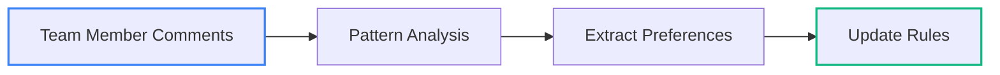
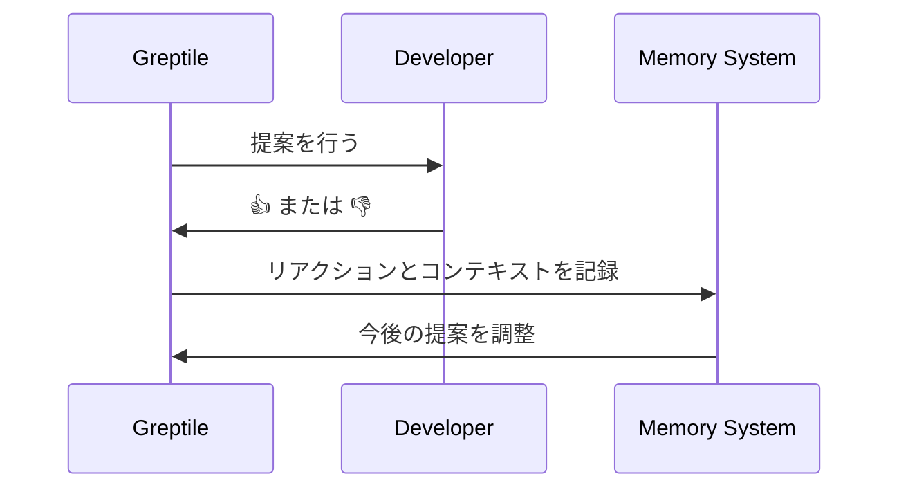
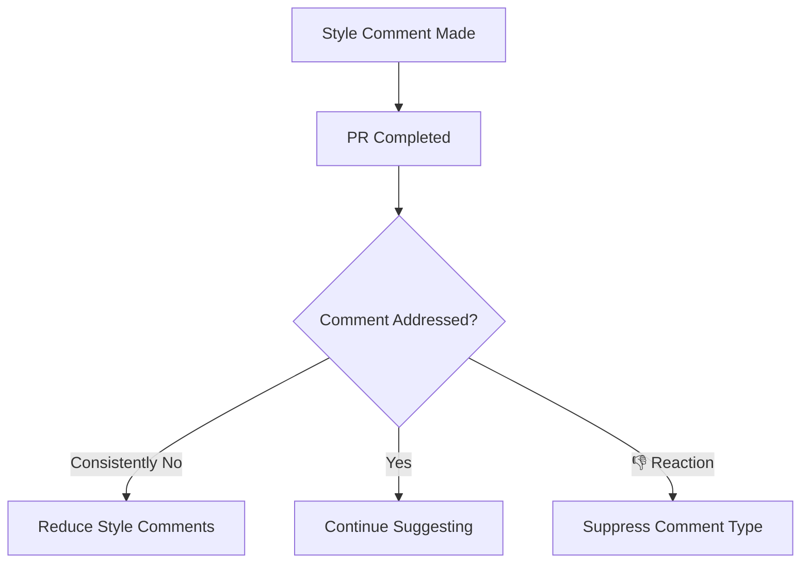
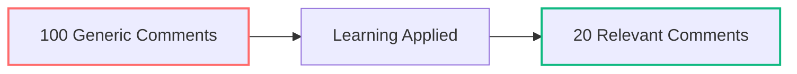
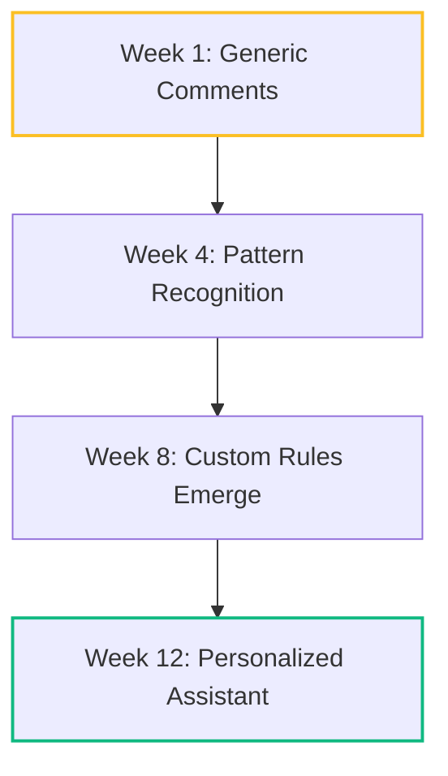

Greptile のメモリシステムは、チームとのあらゆるインタラクションから学習し、より一層パーソナライズされ実用的なコードレビューの提案を提供します。

## Greptile があなたのチームから学習する方法

### 1. PRのチームコメントを読む

Greptile は、チームのコードレビュー議論におけるパターンを観察します:



**学習例:**
```
チームが一貫してコメント:「エラーハンドリングを追加してください」
→ Greptile の学習: このチームではエラーハンドリングが重要

チームがよく言う:「これは async にすべきです」
→ Greptile の学習: チームは async パターンを好む

チームの指摘:「これはサービス層に移動してください」
→ Greptile の学習: チームはレイヤードアーキテクチャに従っている
```

### 2. Greptile への返信から学習

あなたの返信は、何が重要かを Greptile に教えます:

<Tabs>
<Tab title="Positive Responses">
```
Greptile:「このロジックをユーティリティ関数に切り出すことを検討してください」
Developer:「ナイスキャッチ！リファクタします。」
→ Greptile の学習: コード構成に関する提案が評価される
```
</Tab>

<Tab title="Context-Setting Responses">
```
Greptile:「この関数はかなり長いです」
Developer:「当社のドメイン層では、明確さのために詳細な関数を好みます」
→ Greptile の学習: 長さのルールはドメインロジックには適用されない
```
</Tab>

<Tab title="Dismissive Responses">
```
Greptile:「JSDoc コメントの追加を検討してください」
Developer:「内部ユーティリティはドキュメント化しません」
→ Greptile の学習: ドキュメント化の方針はコードの種類によって異なる
```
</Tab>
</Tabs>

### 3. リアクションから学習

サムズアップ／ダウンのリアクションは、提案の品質に対する即時フィードバックになります:



## 細かい指摘レベルの学習

Greptile はコミット分析とリアクションを通じて、軽微な提案に対するチームの許容度を学習します。

### コミットベースの学習

Greptile は最初のコミットと最後のコミットを比較し、どのコメントに対応が行われたかを分析します。



### 適応型ノイズフィルタリング

**細かな指摘に積極的なチーム**（スタイル問題に対応する）:
```
✅ セミコロンの抜け
✅ import の整理  
✅ 関数名の命名
✅ ドキュメントの不足
```

**細かな指摘を好まないチーム**（スタイル問題を無視する）:
```
❌ セミコロンの抜け（3回無視されたら抑制）
❌ import の整理（チームが気にしない）
✅ セキュリティ問題（常にフラグ付け）
✅ ロジックエラー（抑制しない）
```

### 学習のしきい値

```typescript
// Greptile tracks patterns like:
const learningData = {
  semicolonComments: { made: 10, addressed: 0, reactions: -3 },
  securityComments: { made: 5, addressed: 5, reactions: +4 },
  performanceComments: { made: 8, addressed: 6, reactions: +2 }
};

// 結果: セミコロンに関するコメントを停止し、セキュリティを優先
```

## 学習／メモリの効果

### さらに実行しやすいコメント

学習により、汎用的な提案がチーム固有の実践的なガイダンスに変わります:

**学習前（汎用）:**
```
🤖 "エラーハンドリングの追加を検討してください"
🤖 "この関数は短くできます"  
🤖 "ここにドキュメントを追加してください"
🤖 "インデントを修正してください"
```

**学習後（パーソナライズ）:**
```
🤖 "チームの Result<T> パターンに従ってエラーハンドリングを追加してください"
🤖 "（アーキテクチャに沿って）これを複数のドメインメソッドに分割することを検討してください"
🤖 "セキュリティ検証が不足しています——決済系の関数では必須です"
```

### コンテキストの理解

Greptile は、規則を適用すべき場面とそうでない場面を学習します:

<Tabs>
<Tab title="コンテキスト対応ルール">
```typescript
// Greptile learns these patterns:
class PaymentService {
  // ✅ ドメインロジックでは長い関数も許容
  processComplexPayment(data: PaymentData) {
    // 50行超のビジネスロジックでもチームが許容
  }
}

// ❌ ただしユーティリティでは長い関数を指摘
function formatString(input: string) {
  // ここが20行超だと指摘対象
}
```
</Tab>

<Tab title="チーム固有の標準">
```python
# チームA: 例外を明示的に処理する方針
def transfer_funds(amount, account):
    try:
        # 明示的な try/catch
    except Exception as e:
        # エラー処理

# チームB: Result オブジェクトを使用する方針
def transfer_funds(amount, account) -> Result[Transfer]:
    # Success() または Failure() を返す
```
</Tab>
</Tabs>

### レビュー疲労の軽減

メモリによりノイズを減らし、重要な点に集中できます:



**測定可能な効果:**
- 無視されるコメントを 80% 削減
- 提案の採用率が 3倍に向上
- PR レビューのサイクルが高速化
- スタイルではなくアーキテクチャとロジックに注力

## カスタムルールの自動発見

Greptile は、手動設定なしでチームの行動からカスタムルールを自動的に推定します:

### 自動生成ルール

**チームのコメントから:**
```
観測されたパターン: チームは常に「DB 呼び出しはサービス層へ移動」とコメントする
→ 自動生成ルール: 「コントローラに直接的なデータベース呼び出しを含めないこと」

観測されたパターン: チームは一貫して「入力バリデーションを追加してほしい」と求める  
→ 自動生成ルール: 「API エンドポイントには入力バリデーションが必須」
```

### 学習の進化



**進化のタイムライン:**
- **Week 1-2**: 標準的な提案、ノイズが多い
- **Week 3-4**: チームの嗜好を学習、フィルタリングを開始
- **Week 5-8**: カスタムパターンが顕在化、提案が改善
- **Week 9+**: 高度にパーソナライズされた実行可能な推奨

## 実例で見る学習

### チームA：セキュリティ重視のフィンテック

**学習の軌跡:**
```
Month 1: 一般的なセキュリティ提案はスルーされる
Month 2: チームが「当社はカスタムの認証ミドルウェアを使っています」とコメント
Month 3: Greptile がチームの認証パターンを提案するように学習
Result: セキュリティ課題に関する提案の採用率が90%に到達
```

### チームB：パフォーマンス最優先のゲーム開発

**学習の軌跡:**
```
Week 1: スタイルに関するコメントに 👎 リアクション
Week 3: パフォーマンスに関するコメントに 👍 リアクション
Week 6: Greptile はスタイルに関する提案をやめ、パフォーマンスに注力
Result: レビューが高速化し、パフォーマンス最適化が向上
```

## 学習／メモリが重要な理由

<Card title="ノイズを排除" icon="volume-x" horizontal>
チームが一貫して無視する提案をフィルタリングするよう学習します
</Card>

<Card title="コンテキストを構築" icon="brain" horizontal>
チーム固有のパターンや嗜好を理解します
</Card>

<Card title="導入を促進" icon="trending-up" horizontal>
提案の受け入れ率が上がることでコード品質が向上します
</Card>

<Card title="時間を節約" icon="clock" horizontal>
不要な提案に関するやり取りを減らします
</Card>

## 学習によるアドバンテージ

従来の静的解析ツールは、どのチームにも同じ一般的な提案しか行いません。Greptile のメモリシステムは、次の点でパーソナライズされたコードレビュー体験を実現します:

- **適応**: チームのコーディングスタイルや嗜好に合わせて適応
- **学習**: あらゆるやり取りやフィードバックから継続的に学習
- **進化**: 使うほどに価値が高まるように進化
- **注力**: チームにとって本当に重要な課題にフォーカス

その結果、コードベースを理解し、判断を尊重し、余計なノイズなくより良いコード作成を支援する、博識なチームメイトのような AI コードレビュアになります。 