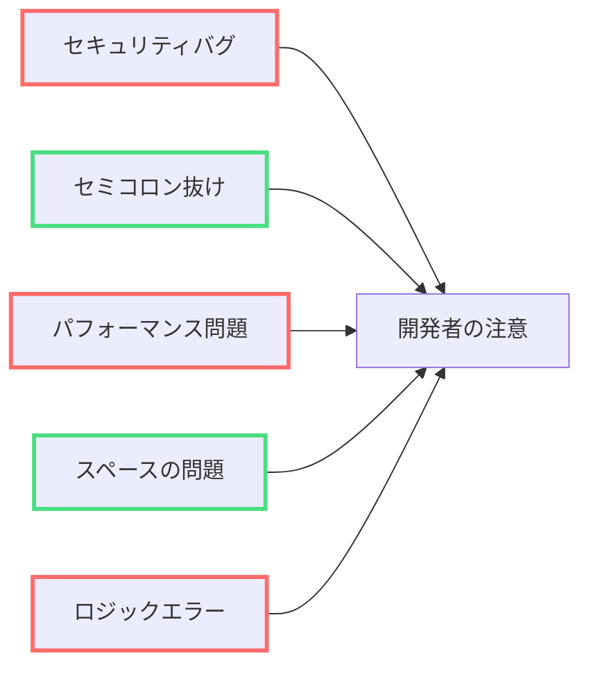
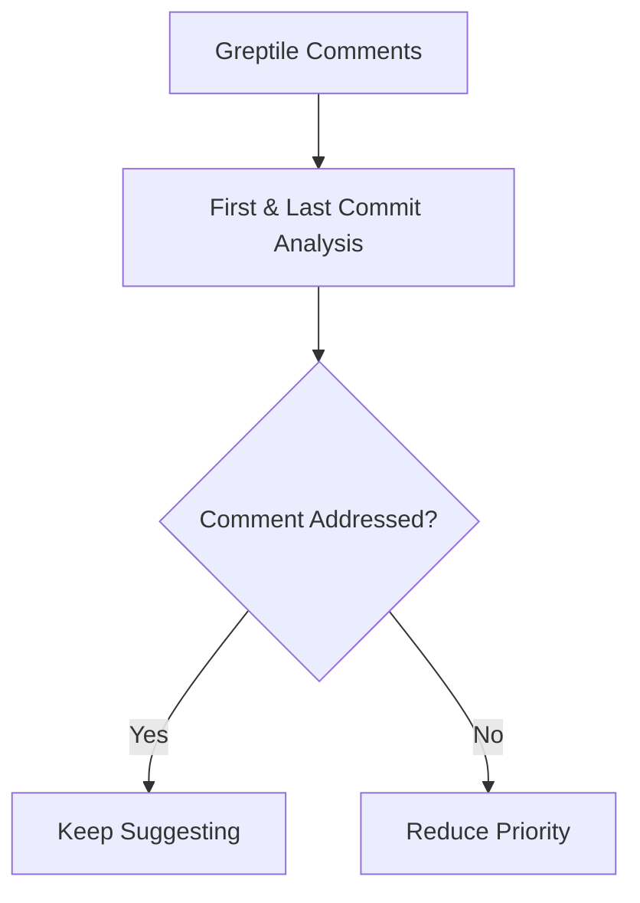
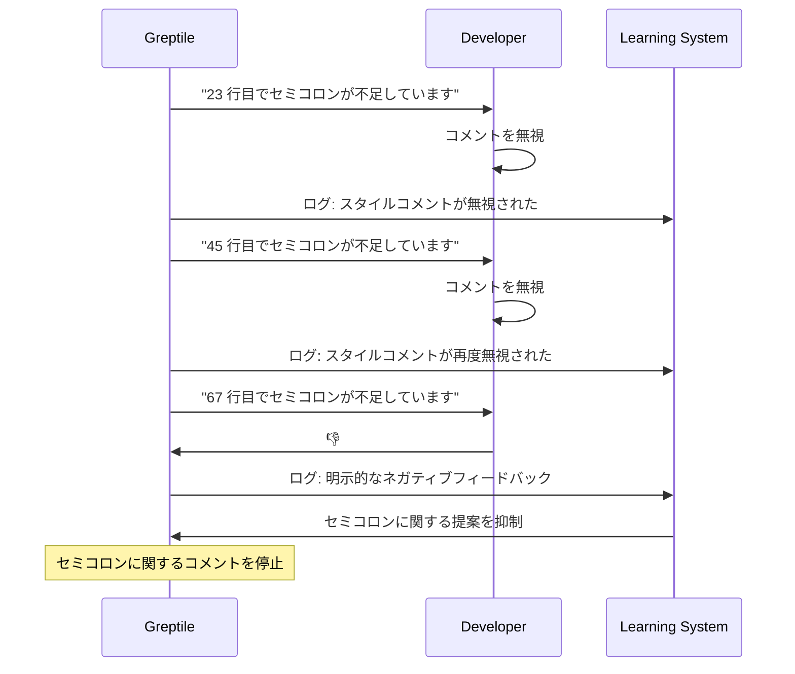
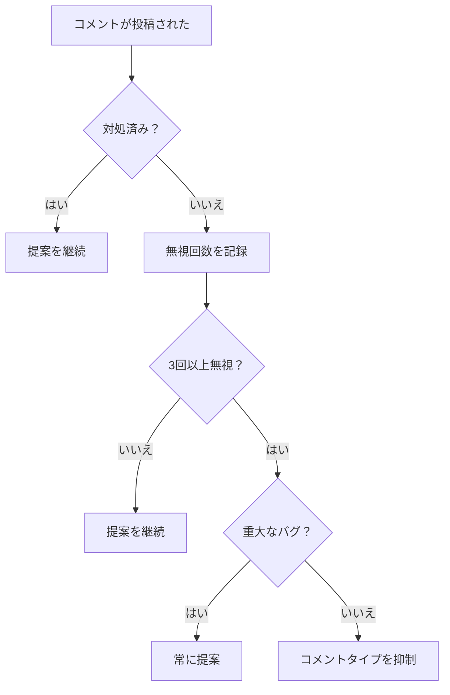

Greptile は、チームが実際に採用・対応した提案を分析し、重要な課題から開発者の注意を逸らす「細かな指摘」を抑えるよう学習します。

## 些末指摘の問題

些末な指摘は、重大な課題から注意をそらす軽微な提案です:



**問題**: 開発者は修正しやすいスタイル上の問題に注意が向き、重大なバグを見落としがちです。

## Greptile がノイズをフィルタリングするために学習する方法

### 1. コミット分析

Greptile はすべての PR の**最初**と**最後**のコミットを読み、どのコメントに対応したかを確認します：



### 2. リアクションからの学習

サムズアップ／サムズダウンのリアクションは即時のフィードバックになります：

<Tabs>
<Tab title="👍 Thumbs Up">
```
Greptile: "ここにエラーハンドリングの追加を検討してください"
Developer: 👍（提案を実装）
→ Greptile の学習: "エラーハンドリングに関する提案は有用"
```
</Tab>

<Tab title="👎 Thumbs Down">
```
Greptile: "行末にセミコロンを追加してください"
Developer: 👎（一貫して無視）
→ Greptile の学習: "このチームはセミコロンを重視していない"
```
</Tab>
</Tabs>

### 3. 学習例

**例 1: スタイルに関するコメントはフィルタリングされる**



**例 2: 重大な問題は常に顕在化する**

```typescript
// チームがスタイルを無視していても、Greptile はこれには必ずコメントします:
function transferMoney(amount, account) {
  // 入力検証なし - セキュリティリスク
  database.transfer(amount, account);
}

// しかし、学習後は次のようなものへのコメントは停止します:
const user = getUser()  // セミコロンが不足 - ただしチームは気にしない
```

## 学習しきい値

Greptile は、チームの行動に基づき特定の種類のコメントを停止します:



### 抑制されるものとされないもの

<AccordionGroup>
<Accordion title="✅ 一貫して無視された場合は抑制される">
- スタイル／フォーマットの問題
- import の整理
- ドキュメント不足（非クリティカル）
- 命名規約からの逸脱
- コード構成に関する好み
</Accordion>

<Accordion title="🚫 決して抑制されない">
- セキュリティ脆弱性
- メモリリーク
- 無限ループ
- ヌルポインタ例外
- ユーザー入力に対するデータ検証の欠如
</Accordion>
</AccordionGroup>

## 結果：焦点の定まったレビュー

**学習前：**
```
PR #123 - ユーザー認証の追加
├── 🔴 入力値検証が不足しています（CRITICAL）
├── 🟡 エラーハンドリングの追加を検討してください
├── 🟢 45行目にセミコロンがありません
├── 🟢 インデントが不一致です
├── 🟢 import の順序を改善できます  
├── 🟢 関数名を改善できます
└── 🟢 JSDoc コメントが不足しています
```

**学習後（チームはスタイル上の問題を無視）：**
```
PR #123 - ユーザー認証の追加  
├── 🔴 入力値検証が不足しています（CRITICAL）
└── 🟡 エラーハンドリングの追加を検討してください
```

## なぜ重要か

<Card title="ノイズの削減" icon="volume" horizontal>
余計なコメントが減り、開発者は本質に集中できます
</Card>

<Card title="レビューの高速化" icon="clock" horizontal>
些末な問題に費やす時間を減らし、ロジックやアーキテクチャに注力できます
</Card>

<Card title="採用率の向上" icon="thumbs-up" horizontal>
焦点が絞られた的確な提案なら、チームは行動に移しやすくなります
</Card>

<Card title="適応型 AI" icon="brain" horizontal>
好みを学習するほど、システムの価値は時間とともに高まります
</Card>

